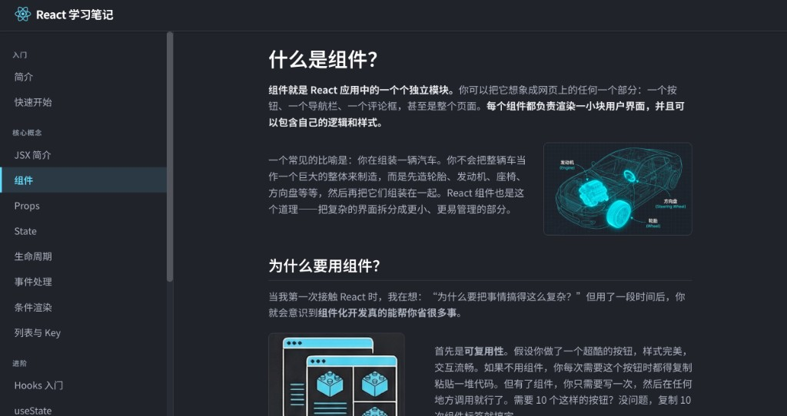

# React 学习笔记

基于 React + Vite 的学习笔记，布局和阅读体验类似 GitBook，内容为 React 入门与进阶知识。按二八法则来学习：用大约 20% 的核心知识（组件、JSX、state、props、生命周期与 Hooks）覆盖日常开发里 80% 的场景。不追求大而全，只把最常用、最易踩坑的部分讲清楚，让你快速上手React基础、少走弯路。

## 功能



- 左侧导航栏（可折叠）
- 多章节 React 知识内容
- 响应式布局，移动端侧边栏可收起
- 代码块、标题、列表等文档样式

## 环境要求

- **Node.js**：建议 18.x 或 20.x（[官网下载](https://nodejs.org/)）
- **npm**：随 Node 自带，或使用 pnpm / yarn

检查版本（可选）：
```bash
node -v   # 建议 >= 18
npm -v
```

## 快速开始

### 1. 获取项目

**方式一：克隆仓库**
```bash
git clone https://github.com/knowledgefxg/react-notes.git
cd react-notes
```

**方式二：下载 ZIP**  
在 [GitHub 仓库](https://github.com/knowledgefxg/react-notes) 页面点击 **Code → Download ZIP**，解压后进入项目目录。

### 2. 安装依赖

在项目根目录执行：
```bash
npm install
```
等待安装完成（首次可能稍慢，会拉取 React、Vite、React Router 等依赖）。

### 3. 启动开发服务器

```bash
npm run dev
```
终端会输出本地地址，例如：
```
  VITE v5.x.x  ready in xxx ms
  ➜  Local:   http://localhost:5173/
```

### 4. 在浏览器中查看

用浏览器打开上述地址（默认 http://localhost:5173），即可看到「React 学习笔记」站点。修改源码会热更新，无需重启。

---

## 构建与预览

需要打包成静态文件（部署到服务器或 GitHub Pages 等）时：

### 1. 执行构建

```bash
npm run build
```
产物会输出到项目根目录的 `dist/` 文件夹。

### 2. 本地预览构建结果

构建完成后，可用 Vite 自带的预览服务检查打包效果：
```bash
npm run preview
```
浏览器打开终端里给出的地址（一般为 http://localhost:4173），看到的效果与部署后一致。

## 技术栈

- React 18
- React Router 6
- Vite 5
- CSS Modules

## 文档结构

- **入门**：简介、快速开始
- **核心概念**：JSX、组件与 Props、State、事件、条件渲染、列表与 Key
- **进阶**：Hooks、useState/useReducer、useEffect、自定义 Hooks、Context
- **实践**：性能优化、与 TypeScript 结合

左侧导航可折叠（小屏下点击左上角菜单图标展开），建议按「入门 → 核心概念 → 进阶 → 实践」顺序阅读；每页内的代码块可直接参考，部分章节带可交互示例。
